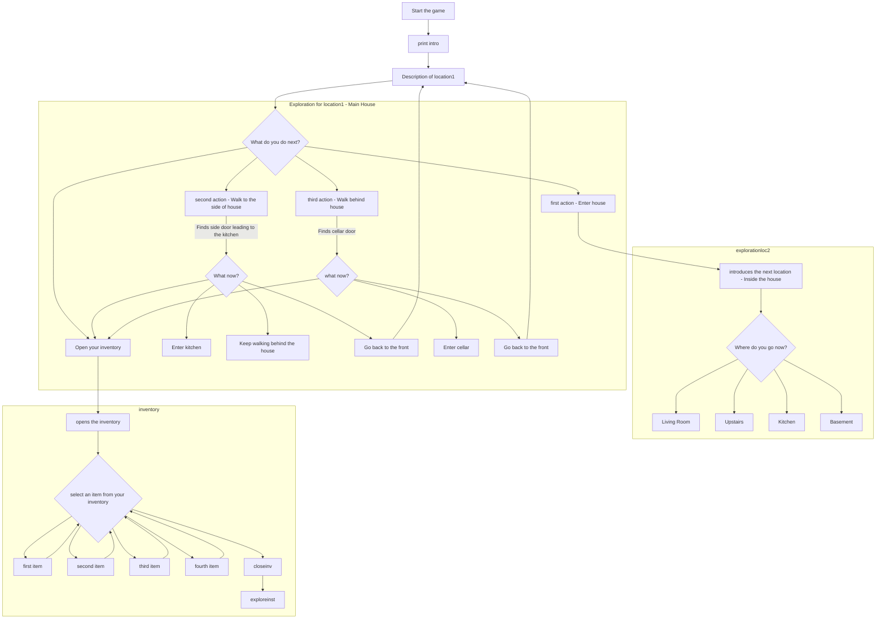

# Introduction

## Contents
[Introduction](#introduction)
[How To Play](#how-to-play)
[Mermaid](#mermaid)
[Links](#links)
[Walkthrough](#walkthrough)

## Me
Hi, I’m Ethan, a computer science student. This project started as part of a course assignment but also serves as a stepping stone in my journey to making my own games. My friend and I share an interest in game development. We both aspire to create a big game and have even collaborated on projects together.

## My game
This is a text-based horror RPG set in a mysterious mansion filled with disturbing secrets. As the protagonist, you’re searching for your missing daughter, only to uncover gruesome experiments and unsettling truths. Explore, solve puzzles, and survive as you uncover the fate of your daughter.

---

# How To Play

## Commands

The game is entirely text-based, requiring typed commands to progress.

You’ll always have a set of core commands to navigate and interact with, but new options can appear as you interact with certain commands.

## Exploration

You can explore at your own pace as I implemented a, sort-of, free roam system allowing you to enter and exit rooms at your leisure. There is a set path to progress but I didn't enforce a set order you need to do them in. 

## Inventory

TBA

## Combat 

TBA

---

# Walkthrough

TBA

---

# Mermaid

## Full Flow Chart


## Main Menu Flow Chart
```
```

## Combat Flow Chart

## Inventory Flow Chart

---

# Changelog

## Version [0.1.0]

- Created the README for the game, outlining the purpose and plan.
- Started designing the structure and flow of the game using a Mermaid flowchart.
- Added a table of contents to the README with links to sections.
- Began organizing the game's core systems and components for future development.

## Version (0.1.1)

- Completed Title Menu
- Started coding the main game loop
- Started and finished coding the puzzles for the first floor.
- Established a basic inventory system for the game.
- Added ASCII art for various interactions in the first floor.


---

# Links

[Github](https://github.com/EthanAlistair)